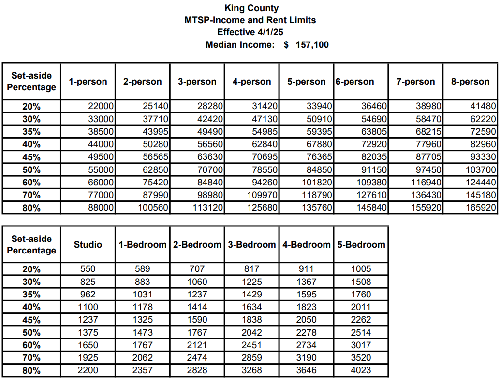

## Housing Markets in Kent, Washington

## Part 1: ACS Data

**American Community Survey (ACS) Estimates**

The first ACS 5-year estimate was released in late 2010 as a replacement of the
longform decennial Census. Every year, the ACS surveys about 1 in 40 housing
units to produce 1-year estimates, but these housing units must not have been
surveyed in the previous five years. Hence, the 5-year estimate incorporates
five years of non-overlapping data (approximately 1 in 8 housing units) to
recreate the longform of the decennial census.

In this exploratory data analysis, I used three separate (i.e. no overlapping
years) ACS 5-year estimates to provide snapshots over time: 2010-2014, 2015-19,
and 2020-2024.

### Step 1: Load Demographic Data using `tidycensus`

```{r setup}
#| message: false
#| warning: false
#| results: 'hide'

# Load required packages
library(tidyverse)
library(tidycensus)
library(janitor)
library(sf)
library(tigris)
library(scales)
library(patchwork)
library(RColorBrewer)
library(units)
library(knitr)
library(caret)
```

```{r}
#| echo: false
#| include: false

# Set Census API key
census_api_key("fe841b7ef0aa73d9579f0517bd1c8f26d33c789b")

# Get working directory
getwd()

# Options
options(warn=-1)
```

```{r, eval = FALSE}
# Load all available variables for ACS 5-year 2024
acs_vars_2024 <- load_variables(2024, "acs5", cache = TRUE)
```

```{r, results = 'hide'}
# Helper Variables for Summing Population Values for Children aged 5-19
child_pop = c("B01001_004", "B01001_005", "B01001_006", "B01001_007", 
                "B01001_028", "B01001_029", "B01001_030", "B01001_031")


# Helper Variable for Summing Population Values for Elderly Population
elderly_pop = c("B01001_020", "B01001_021", "B01001_022", "B01001_023", 
                "B01001_024", "B01001_025", 
                "B01001_044", "B01001_045", "B01001_046", 
                "B01001_047", "B01001_048", "B01001_049")

# Helper Function for Variables
vars <- c(
  # Demographic Indicators
  total_pop = "B01003_001",
  child_pop = child_pop,
  elderly_pop = elderly_pop,
  median_income = "B19013_001",
  poverty_total = "B17001_001",
  poverty_level = "B17001_002",
  White     = "B03002_003",
  Black     = "B03002_004",
  Hispanic  = "B03002_012",
  
  # Number of Renters at Rent Burden %
  renter_total    = "B25070_001",
  rentb_30_34    = "B25070_007",
  rentb_35_39    = "B25070_008",
  rentb_40_49    = "B25070_009",
  rentb_50_plus  = "B25070_010",
  
  # Housing Indicators
  median_rent = "B25064_001",
  vacant_units = "B25002_003",
  total_units = "B25034_001",
  owner_occupied = "B25003_002",
  renter_occupied = "B25003_003",
  built_2020_plus = "B25034_002", # Built 2020 or later
  built_2010_plus = "B25034_003", # Built 2010 to 2019
  
  # Median Income Distribution
  income_50_60k = "B19001_011",
  income_60_75k = "B19001_012",
  income_75_100k = "B19001_013", 
  income_100_125k = "B19001_014"
)

# Helper Function for Summarizing ACS
summarize_acs <- function(df) {
  df |> 
      mutate(
      elderly_popE = rowSums(across(matches("^elderly_pop\\d+E$")), na.rm = TRUE),
      child_popE   = rowSums(across(matches("^child_pop\\d+E$")),   na.rm = TRUE),
      income_50_100k = income_50_60kE + income_60_75kE + income_75_100kE,

      # percentages
      pct_elderly  = round((elderly_popE / total_popE) * 100, 2),
      pct_child    = round((child_popE   / total_popE) * 100, 2),
      pct_white    = round((WhiteE       / total_popE) * 100, 2),
      pct_black    = round((BlackE       / total_popE) * 100, 2),
      pct_hispanic = round((HispanicE    / total_popE) * 100, 2),
      pct_poverty  = round((poverty_levelE / poverty_totalE) * 100, 2),
      pct_renter   = 100 * renter_occupiedE / total_unitsE,
      vacancy_rate = 100 * vacant_unitsE / total_unitsE,
      pct_income_50_100k = 100 * income_50_100k / total_popE,
      pct_rent_burden = 100 * (rentb_30_34E + rentb_35_39E + rentb_40_49E + rentb_50_plusE) / renter_totalE,
      pct_built_after_2010 = 100 * (built_2020_plusE + built_2010_plusE) / total_unitsE
      ) |>
    select(any_of(c(
      "GEOID", "tract_name", "county_name", "total_popE", "median_incomeE",
      "elderly_popE", "pct_elderly",
      "child_popE", "pct_child",
      "pct_poverty", "pct_white", "pct_black", "pct_hispanic",
      "pct_renter", "median_rentE", "pct_rent_burden",
      "vacant_units", "total_units", "vacancy_rate",
      "built_2020_plus", "built_2010_plus",
      "pct_built_after_2010",
      "income_50_60k", "income_60_75k", "income_75_100k", "pct_income_50_100k",
      "geometry")))
}
```

```{r}
# Helper Function
get_data <- function(year){
  get_acs(
    geography = "tract",
    variables = vars,
    state = "WA",
    county = "King",
    year = year,
    survey = "acs5",
    output = "wide",
    geometry = TRUE
  ) 
}
```

```{r, progress = FALSE}
#| message: false
#| warning: false
#| results: 'hide'
kent_2014 <- get_data(2014)
kent_2019 <- get_data(2019)
kent_2024 <- get_data(2024)
```

```{r}
# Clean the county names to remove state name and "County" 
kent_2024_clean <- kent_2024 |> 
  separate(
    NAME, 
    into = c("tract_name", "county_name", "state_name"), 
    sep = "; "
  ) |> 
  mutate(
    tract_name = str_remove(tract_name, "Census Tract "),
    county_name = str_remove(county_name, " County")
  )
kent_2024_summary <- summarize_acs(kent_2024_clean)
```

```{r}
kent_2019_clean <- kent_2019 |> 
  separate(
    NAME, 
    into = c("tract_name", "county_name", "state_name"), 
    sep = ", "
  ) |> 
  mutate(
    tract_name = str_remove(tract_name, "Census Tract "),
    county_name = str_remove(county_name, " County")
  )
kent_2019_summary <- summarize_acs(kent_2019_clean)
```

```{r}
kent_2014_clean <- kent_2014 |> 
  separate(
    NAME, 
    into = c("tract_name", "county_name", "state_name"), 
    sep = ", "
  ) |> 
  mutate(
    tract_name = str_remove(tract_name, "Census Tract "),
    county_name = str_remove(county_name, " County")
  )
kent_2014_summary <- summarize_acs(kent_2014_clean)
```

--------------------------------------------------------------------------------

### Step 2: Filter Data

```{r}
# List of GeoIDs near Downtown Kent
# Focus is on Census Tract 292.03

tracts_curr <- c(292.06, 292.03, 292.04, 292.08, 292.07, 293.05, 295.03, 295.05, 297.01, 297.02, 298.03, 292.05, 292.01, 283, 294.07, 295.04, 294.03, 294.08, 297, 298.01, 294.06, 295.08, 295.07, 295.06, 294.06, 296.03, 295.02, 296.01)
```

```{r}
kent_2024 <- kent_2024_summary |>
  filter(tract_name %in% tracts_curr)

kent_2024_tract <- kent_2024 |> 
  st_drop_geometry()
head(kent_2024_tract)
```

```{r}
kent_2019 <- kent_2019_summary |>
  filter(tract_name %in% tracts_curr)

kent_2019_tract <- kent_2019 |> 
  st_drop_geometry()
head(kent_2019_tract)
```

```{r}
kent_2014 <- kent_2014_summary |>
  filter(tract_name %in% tracts_curr)

kent_2014_tract <- kent_2014 |> 
  st_drop_geometry()
head(kent_2014_tract)
```

--------------------------------------------------------------------------------

## Part 2: Comprehensive Visualization and Analysis

```{r}
# Check Projections
st_crs(kent_2014) == st_crs(kent_2024)
```

```{r}
cols_to_suffix <- c(
  "total_popE","median_incomeE",
  "elderly_popE","pct_elderly",
  "child_popE","pct_child",
  "pct_poverty",
  "pct_white","pct_black","pct_hispanic",
  "median_rentE",
  "pct_renter", "pct_rent_burden",
  "vacancy_rate",
  "pct_built_after_2010", 
  "pct_income_50_100k"
)
```

```{r}
h14_sf <- kent_2014 |>
  rename_with(~ paste0(.x, "_2014"), any_of(cols_to_suffix))

h14 <- kent_2014_tract |>
  rename_with(~ paste0(.x, "_2014"), any_of(cols_to_suffix))

h19_sf <- kent_2019 |>
  rename_with(~ paste0(.x, "_2019"), any_of(cols_to_suffix))

h19 <- kent_2019_tract |>
  rename_with(~ paste0(.x, "_2019"), any_of(cols_to_suffix))

h24_sf <- kent_2024 |>
  rename_with(~ paste0(.x, "_2024"), any_of(cols_to_suffix))

h24 <- kent_2024_tract |>
  rename_with(~ paste0(.x, "_2024"), any_of(cols_to_suffix))
```

## Normalizing Census Tract Boundaries

```{r}
# ---- Prepare Each Year Separately (KEEP GEOMETRY) ----

h14_sf <- kent_2014 |>
  rename_with(~ paste0(.x, "_2014"), any_of(cols_to_suffix)) |>
  mutate(period = "2014") |>
  select(GEOID, tract_name, county_name, period, geometry, ends_with("_2014")) |>
  rename_with(~ sub("_2014$", "", .x), ends_with("_2014"))

h19_sf <- kent_2019 |>
  rename_with(~ paste0(.x, "_2019"), any_of(cols_to_suffix)) |>
  mutate(period = "2019") |>
  select(GEOID, tract_name, county_name, period, geometry, ends_with("_2019")) |>
  rename_with(~ sub("_2019$", "", .x), ends_with("_2019"))

h24_sf <- kent_2024 |>
  rename_with(~ paste0(.x, "_2024"), any_of(cols_to_suffix)) |>
  mutate(period = "2024") |>
  select(GEOID, tract_name, county_name, period, geometry, ends_with("_2024")) |>
  rename_with(~ sub("_2024$", "", .x), ends_with("_2024"))

# ---- Stack Years (NO JOINS) ----
compare_sf <- bind_rows(h14_sf, h19_sf, h24_sf)

# ---- Convert Wide to Long ----
long_panel <- compare_sf |>
  pivot_longer(
    cols = all_of(cols_to_suffix),
    names_to = "metric",
    values_to = "value"
  )

# Label geometry
long_panel_pts <- long_panel |>
  st_point_on_surface()

# ---- Facet Helper ----
facet_metric <- function(metric_name, title, fill_lab,
                         fill_lab_fmt = NULL, text_fmt = NULL,
                         text_size = 1.5,
                         box_fill = alpha("white", 0.60)) {

  dat <- long_panel     |> filter(metric == metric_name)
  lab <- long_panel_pts |> filter(metric == metric_name)

  if (is.null(text_fmt)) text_fmt <- scales::label_number(accuracy = 1)
  lab <- lab |> mutate(lbl = text_fmt(value))

  ggplot() +
    geom_sf(data = dat,
            aes(fill = value),
            color = "white",
            linewidth = 0.5) +
    geom_sf_label(data = lab,
                  aes(label = lbl),
                  size = text_size,
                  label.size = 0,
                  label.padding = unit(1.2, "pt"),
                  fill = box_fill,
                  color = "black",
                  label.r = unit(1.5, "pt"),
                  check_overlap = TRUE,
                  na.rm = TRUE,
                  show.legend = FALSE) +
    facet_wrap(~ period, nrow = 1) +
    labs(
      title = title,
      subtitle = "Panels: 2010–2014, 2015–2019, 2020–2024",
      fill = fill_lab,
      caption = "Data Source: ACS 5-year estimates"
    ) +
    theme_void() +
    theme(legend.position = "right") +
    {
      if (is.null(fill_lab_fmt)) {
        scale_fill_viridis_c()
      } else {
        scale_fill_viridis_c(labels = fill_lab_fmt)
      }
    }
}

# ---- Format Labels ----
pct_fmt <- scales::label_number(accuracy = 0.1, suffix = "%")
dol_fmt <- scales::label_dollar(accuracy = 1)
pop_fmt <- scales::label_number(big.mark = ",", accuracy = 1)

# ---- Facet Maps ----
facet_metric("pct_poverty",    "Kent: % in Poverty", "%", fill_lab_fmt = pct_fmt, text_fmt = pct_fmt)
facet_metric("pct_white",      "Kent: % White (race alone)", "%", fill_lab_fmt = pct_fmt, text_fmt = pct_fmt)
facet_metric("pct_black",      "Kent: % Black (race alone)", "%", fill_lab_fmt = pct_fmt, text_fmt = pct_fmt)
facet_metric("pct_hispanic",   "Kent: % Hispanic (any race)", "%", fill_lab_fmt = pct_fmt, text_fmt = pct_fmt)
facet_metric("total_popE", "Kent: Total Population", "Population", text_fmt = pop_fmt)
facet_metric("pct_child",      "Kent: % Children (Under 18)", "%", fill_lab_fmt = pct_fmt, text_fmt = pct_fmt)
facet_metric("pct_elderly",    "Kent: % Elderly (65+)", "%", fill_lab_fmt = pct_fmt, text_fmt = pct_fmt)
facet_metric("median_incomeE", "Kent: Median Household Income", "$", fill_lab_fmt = dol_fmt, text_fmt = dol_fmt)
facet_metric("pct_renter", "Kent: % Renter Households", "%", fill_lab_fmt = pct_fmt, text_fmt = pct_fmt)
facet_metric("pct_rent_burden","Kent: % Renters Cost Burdened", "%", fill_lab_fmt = pct_fmt, text_fmt = pct_fmt)
facet_metric("pct_income_50_100k", "Kent: % Households $50k–$100k", "%", fill_lab_fmt = pct_fmt, text_fmt = pct_fmt)
facet_metric("median_rentE",   "Kent: Median Gross Rent", "$", fill_lab_fmt = dol_fmt, text_fmt = dol_fmt)
facet_metric("vacancy_rate",   "Kent: Housing Vacancy Rate", "%", fill_lab_fmt = pct_fmt, text_fmt = pct_fmt)
```

```{r, progress = FALSE}
#| message: false
#| warning: false
#| results: 'hide'

# Check changes in census tract boundaries in Kent, WA
old <- tracts(
  state = "WA",
  county = "King",
  year = 2010,
  class = "sf"
)

new <- tracts(
  state = "WA",
  county = "King",
  year = 2020,
  class = "sf"
)
```

```{r}
library(tmap)

tm_shape(old) +
  tm_borders(col = "red") +
  tm_shape(new) +
  tm_borders(col = "blue")##
```

### Data Sources

- 2020 Census Tracts:
  <https://experience.arcgis.com/experience/2e2dc414086648128bbf96f552817e7e#data_s=id%3AdataSource_1-19e98e1f436-layer-34%3A273>

- 2010 Census Tracts:
  <https://kingcounty.maps.arcgis.com/apps/mapviewer/index.html?layers=e7cee1dc4ab948aca528e6c753551c89>

- Census Reporter (based on ACS 2024 5-Year):
  <https://censusreporter.org/profiles/14000US53033029206-census-tract-29206-king-wa/>

- Washington State Housing Finance Commission (WSHFC) 2025 Income and Rent
  Limits:
  <https://www.wshfc.org/managers/AMCLimits/Others/BoxInfo/2025%20Income%20and%20Rent%20Limit%20Charts.pdf>


