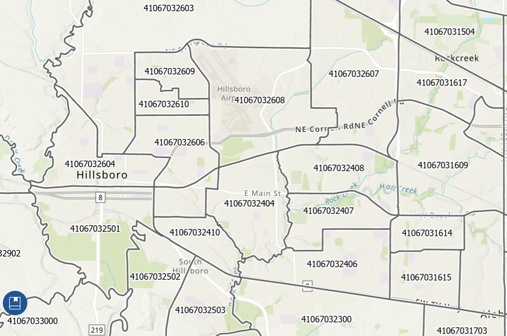

## Housing Markets in Portland, Oregon

## Part 1: ACS Data

**American Community Survey (ACS) Estimates**

The first ACS 5-year estimate was released in late 2010 as a replacement of the
longform decennial Census. Every year, the ACS surveys about 1 in 40 housing
units to produce 1-year estimates, but these housing units must not have been
surveyed in the previous five years. Hence, the 5-year estimate incorporates
five years of non-overlapping data (approximately 1 in 8 housing units) to
recreate the longform of the decennial census.

In this exploratory data analysis, I used three separate (i.e. no overlapping
years) ACS 5-year estimates to provide snapshots over time: 2010-2014, 2015-19,
and 2020-2024.

### Step 1: Load Portland Demographic Data using `tidycensus`

```{r setup}
#| message: false
#| warning: false
#| results: 'hide'

# Load required packages
library(tidyverse)
library(tidycensus)
library(janitor)
library(sf)
library(tigris)
library(scales)
library(patchwork)
library(RColorBrewer)
library(units)
library(knitr)
library(caret)
```

```{r}
#| echo: false
#| include: false

# Set Census API key
census_api_key("fe841b7ef0aa73d9579f0517bd1c8f26d33c789b")

# Get working directory
getwd()

# Options
options(warn=-1)
```

```{r, eval = FALSE}
# Load all available variables for ACS 5-year 2024
acs_vars_2024 <- load_variables(2024, "acs5", cache = TRUE)
```

```{r, results = 'hide'}
# Helper Variables for Summing Population Values for Children aged 5-19
child_pop = c("B01001_004", "B01001_005", "B01001_006", "B01001_007", 
                "B01001_028", "B01001_029", "B01001_030", "B01001_031")


# Helper Variable for Summing Population Values for Elderly Population
elderly_pop = c("B01001_020", "B01001_021", "B01001_022", "B01001_023", 
                "B01001_024", "B01001_025", 
                "B01001_044", "B01001_045", "B01001_046", 
                "B01001_047", "B01001_048", "B01001_049")

# Helper Function for Variables
vars <- c(
  # Demographic Indicators
  total_pop = "B01003_001",
  child_pop = child_pop,
  elderly_pop = elderly_pop,
  median_income = "B19013_001",
  poverty_total = "B17001_001",
  poverty_level = "B17001_002",
  White     = "B03002_003",
  Black     = "B03002_004",
  Hispanic  = "B03002_012",
  
  # --- Rent Burden (30%+) ---
  rent_30_34          = "B25070_007",
  rent_35_39          = "B25070_008",
  rent_40_49          = "B25070_009",
  rent_50_plus        = "B25070_010",
  
  # Housing Indicators
  median_rent = "B25064_001",
  vacant_units = "B25002_003",
  total_units = "B25034_001",
  owner_occupied = "B25003_002",
  renter_occupied = "B25003_003",
  built_2020_plus = "B25034_002", # Built 2020 or later
  built_2010_plus = "B25034_003", # Built 2010 to 2019
  
  # Median Income Distribution
  income_75_100k = "B19001_013", 
  income_100_125k = "B19001_014"
)

# Helper Function for Summarizing ACS
summarize_acs <- function(df) {
  df |> 
      mutate(
      elderly_popE = rowSums(across(matches("^elderly_pop\\d+E$")), na.rm = TRUE),
      child_popE   = rowSums(across(matches("^child_pop\\d+E$")),   na.rm = TRUE),

      # percentages
      pct_elderly  = round((elderly_popE / total_popE) * 100, 2),
      pct_child    = round((child_popE   / total_popE) * 100, 2),
      pct_white    = round((WhiteE       / total_popE) * 100, 2),
      pct_black    = round((BlackE       / total_popE) * 100, 2),
      pct_hispanic = round((HispanicE    / total_popE) * 100, 2),
      pct_poverty  = round((poverty_levelE / poverty_totalE) * 100, 2),
      pct_renter = 100 * renter_occupiedE / total_unitsE,
      vacancy_rate = 100 * vacant_unitsE /
                     (vacant_unitsE + total_unitsE),
      pct_rent_burden = 100 * (
        rent_30_34E + rent_35_39E + rent_40_49E + rent_50_plusE) / renter_occupiedE) |>
    select(any_of(c(
      "GEOID", "tract_name", "county_name", "total_popE", "median_incomeE",
      "elderly_popE", "pct_elderly",
      "child_popE", "pct_child",
      "pct_poverty", "pct_white", "pct_black", "pct_hispanic",
      "pct_renter", "median_rentE", "pct_rent_burden",
      "vacancy_rate","geometry")))
}
```

```{r}
# Define Counties in Portland Metropolitan Area
pma_counties <- c("Multnomah", "Washington", "Clackamas")
```

```{r}
# Helper Function
get_pma_data <- function(year){
  get_acs(
    geography = "tract",
    variables = vars,
    state = "OR",
    county = pma_counties,
    year = year,
    survey = "acs5",
    output = "wide",
    geometry = TRUE
  ) 
}
```

```{r, progress = FALSE}
#| message: false
#| warning: false
#| results: 'hide'
pma_2014 <- get_pma_data(2014)
pma_2019 <- get_pma_data(2019)
pma_2024 <- get_pma_data(2024)
```

```{r}
# Clean the county names to remove state name and "County" 
pma_2024_clean <- pma_2024 |> 
  separate(
    NAME, 
    into = c("tract_name", "county_name", "state_name"), 
    sep = "; "
  ) |> 
  mutate(
    tract_name = str_remove(tract_name, "Census Tract "),
    county_name = str_remove(county_name, " County")
  )
pma_2024_summary <- summarize_acs(pma_2024_clean)
```

```{r}
pma_2019_clean <- pma_2019 |> 
  separate(
    NAME, 
    into = c("tract_name", "county_name", "state_name"), 
    sep = ", "
  ) |> 
  mutate(
    tract_name = str_remove(tract_name, "Census Tract "),
    county_name = str_remove(county_name, " County")
  )
pma_2019_summary <- summarize_acs(pma_2019_clean)
```

```{r}
pma_2014_clean <- pma_2014 |> 
  separate(
    NAME, 
    into = c("tract_name", "county_name", "state_name"), 
    sep = ", "
  ) |> 
  mutate(
    tract_name = str_remove(tract_name, "Census Tract "),
    county_name = str_remove(county_name, " County")
  )
pma_2014_summary <- summarize_acs(pma_2014_clean)
```

--------------------------------------------------------------------------------

### Step 2: Filter Data for Hillsboro

```{r}
# List of Hillsboro GeoIDs based on current Census Tracts
# Source:
# https://www.cityhealthdashboard.com/OR/Hillsboro/city-overview?tab=census_tract

hb_geoids_curr <- c(
  "41067031616", #Tanasbourne
  "41067031617",
  "41067031618",
  "41067031625", #Amberglen
  "41067031626",
  "41067032404",
  "41067032407",
  "41067032409",
  "41067032410",
  "41067032411",
  "41067032412", #Witch Hazel
  "41067032413", #Orenco
  "41067032414",
  "41067032501", #Hillsboro South
  "41067032603",
  "41067032604", #Hillsboro Downtown
  "41067032606",
  "41067032608",
  "41067032609",
  "41067032610",
  "41067032611",
  "41067032612"
)
```

```{r}
# List of Hillsboro GeoIDs based on 2015 Census Tracts
# Source: 
# https://mtgis-portal.geo.census.gov/arcgis/apps/experiencebuilder/experience/?id=dfcab6665ce74efe8cf257aab47ebee1

hb_geoids_old <- c(
  "41067031609",
  "41067031616", #Tanasbourne
  "41067031617",
  "41067031618",
  "41067031625", #Amberglen
  "41067031626",
  "41067032404",
  "41067032406",
  "41067032407",
  "41067032408",
  "41067032409",
  "41067032410",
  "41067032411",
  "41067032412", #Witch Hazel
  "41067032413", #Orenco
  "41067032414",
  "41067032501", #Hillsboro South
  "41067032603",
  "41067032604", #Hillsboro Downtown
  "41067032606",
  "41067032607",
  "41067032608",
  "41067032609",
  "41067032610",
  "41067032611",
  "41067032612"
)
```



```{r}
hillsboro_2024 <- pma_2024_summary |>
  filter(county_name == "Washington") |> 
  filter(GEOID %in% hb_geoids_curr)

hillsboro_2024_tract <- hillsboro_2024 |> 
  st_drop_geometry()
head(hillsboro_2024_tract)
```

```{r}
hillsboro_2019 <- pma_2019_summary |>
  filter(county_name == "Washington") |> 
  filter(GEOID %in% hb_geoids_old)

hillsboro_2019_tract <- hillsboro_2019 |> 
  st_drop_geometry()
head(hillsboro_2019_tract)
```

```{r}
hillsboro_2014 <- pma_2014_summary |>
  filter(county_name == "Washington") |> 
  filter(GEOID %in% hb_geoids_old)

hillsboro_2014_tract <- hillsboro_2014 |> 
  st_drop_geometry()
head(hillsboro_2014_tract)
```

--------------------------------------------------------------------------------

## Part 2: Basic Income Visualization

```{r}
ggplot(hillsboro_2024) +
  geom_sf(aes(fill = median_incomeE), color = "grey30", linewidth = 0.2) +
  geom_sf_text(
    data = hillsboro_2024,
    aes(label = GEOID),       
    size = 3,
    color = "black",
    check_overlap = TRUE
  ) +
  scale_fill_viridis_c(
    option = "plasma",
    name = "Median Income",
    labels = label_dollar(accuracy = 100)
  ) +
  labs(
    title = "Hillsboro: Median Household Income (2020–2024)",
    caption = "Source: ACS 5-Year Estimates"
  ) +
  theme_void() +
  theme(
    legend.position = "right",
    plot.title = element_text(size = 16, face = "bold"),
    plot.subtitle = element_text(size = 12),
    plot.caption = element_text(size = 9))
```

```{r}
ggplot(hillsboro_2019) +
  geom_sf(aes(fill = median_incomeE), color = "grey30", linewidth = 0.2) +
  geom_sf_text(
    data = hillsboro_2019,
    aes(label = GEOID),       
    size = 3,
    color = "black",
    check_overlap = TRUE
  ) +
  scale_fill_viridis_c(
    option = "plasma",
    name = "Median Income",
    labels = label_dollar(accuracy = 100)
  ) +
  labs(
    title = "Hillsboro: Median Household Income (2015–2019)",
    caption = "Source: ACS 5-Year Estimates"
  ) +
  theme_void() +
  theme(
    legend.position = "right",
    plot.title = element_text(size = 16, face = "bold"),
    plot.subtitle = element_text(size = 12),
    plot.caption = element_text(size = 9))
```

```{r}
ggplot(hillsboro_2014) +
  geom_sf(aes(fill = median_incomeE), color = "grey30", linewidth = 0.2) +
  geom_sf_text(
    data = hillsboro_2014,
    aes(label = GEOID),       
    size = 3,
    color = "black",
    check_overlap = TRUE
  ) +
  scale_fill_viridis_c(
    option = "plasma",
    name = "Median Income",
    labels = label_dollar(accuracy = 100)
  ) +
  labs(
    title = "Hillsboro: Median Household Income (2010–2014)",
    caption = "Source: ACS 5-Year Estimates"
  ) +
  theme_void() +
  theme(
    legend.position = "right",
    plot.title = element_text(size = 16, face = "bold"),
    plot.subtitle = element_text(size = 12),
    plot.caption = element_text(size = 9))
```

--------------------------------------------------------------------------------

## Part 3: Comprehensive Visualization and Analysis

```{r}
# Check Projections
st_crs(hillsboro_2014) == st_crs(hillsboro_2024)
```

```{r}
cols_to_suffix <- c(
  "total_popE","median_incomeE",
  "elderly_popE","pct_elderly",
  "child_popE","pct_child",
  "pct_poverty",
  "pct_white","pct_black","pct_hispanic"
)
```

```{r}
h14_sf <- hillsboro_2014 |>
  rename_with(~ paste0(.x, "_2014"), any_of(cols_to_suffix))

h14 <- hillsboro_2014_tract |>
  rename_with(~ paste0(.x, "_2014"), any_of(cols_to_suffix))

h19_sf <- hillsboro_2019 |>
  rename_with(~ paste0(.x, "_2019"), any_of(cols_to_suffix))

h19 <- hillsboro_2019_tract |>
  rename_with(~ paste0(.x, "_2019"), any_of(cols_to_suffix))

h24_sf <- hillsboro_2024 |>
  rename_with(~ paste0(.x, "_2024"), any_of(cols_to_suffix))

h24 <- hillsboro_2024_tract |>
  rename_with(~ paste0(.x, "_2024"), any_of(cols_to_suffix))
```

```{r}
#| echo: false
#| include: false
#| eval: false

# Population change
pop_change_14_24       = total_popE_2024 - total_popE_2014
pop_pct_change_14_24   = 100 * (total_popE_2024 - total_popE_2014) / 
                         total_popE_2014

# Demographics
d_pct_child_14_24      = pct_child_2024    - pct_child_2014
d_pct_elderly_14_24    = pct_elderly_2024  - pct_elderly_2014
d_pct_poverty_14_24    = pct_poverty_2024  - pct_poverty_2014
d_pct_white_14_24      = pct_white_2024    - pct_white_2014
d_pct_black_14_24      = pct_black_2024    - pct_black_2014
d_pct_hispanic_14_24   = pct_hispanic_2024 - pct_hispanic_2014

# Income change
d_income_14_19         = median_incomeE_2019 - median_incomeE_2014
d_income_19_24         = median_incomeE_2024 - median_incomeE_2019
d_income_14_24         = median_incomeE_2024 - median_incomeE_2014
```


## Normalizing Census Tract Boundaries

```{r}
# ---- Prepare Each Year Separately (KEEP GEOMETRY) ----

h14_sf <- hillsboro_2014 |>
  rename_with(~ paste0(.x, "_2014"), any_of(cols_to_suffix)) |>
  mutate(period = "2014") |>
  select(GEOID, tract_name, county_name, period, geometry, ends_with("_2014")) |>
  rename_with(~ sub("_2014$", "", .x), ends_with("_2014"))

h19_sf <- hillsboro_2019 |>
  rename_with(~ paste0(.x, "_2019"), any_of(cols_to_suffix)) |>
  mutate(period = "2019") |>
  select(GEOID, tract_name, county_name, period, geometry, ends_with("_2019")) |>
  rename_with(~ sub("_2019$", "", .x), ends_with("_2019"))

h24_sf <- hillsboro_2024 |>
  rename_with(~ paste0(.x, "_2024"), any_of(cols_to_suffix)) |>
  mutate(period = "2024") |>
  select(GEOID, tract_name, county_name, period, geometry, ends_with("_2024")) |>
  rename_with(~ sub("_2024$", "", .x), ends_with("_2024"))

# ---- Stack Years (NO JOINS) ----
compare_sf <- bind_rows(h14_sf, h19_sf, h24_sf)

# ---- Convert Wide to Long ----
long_panel <- compare_sf |>
  pivot_longer(
    cols = all_of(cols_to_suffix),
    names_to = "metric",
    values_to = "value"
  )

# Label geometry
long_panel_pts <- long_panel |>
  st_point_on_surface()

# ---- Facet Helper ----
facet_metric <- function(metric_name, title, fill_lab,
                         fill_lab_fmt = NULL, text_fmt = NULL,
                         text_size = 3,
                         box_fill = alpha("white", 0.60)) {

  dat <- long_panel     |> filter(metric == metric_name)
  lab <- long_panel_pts |> filter(metric == metric_name)

  if (is.null(text_fmt)) text_fmt <- scales::label_number(accuracy = 1)
  lab <- lab |> mutate(lbl = text_fmt(value))

  ggplot() +
    geom_sf(data = dat,
            aes(fill = value),
            color = "white",
            linewidth = 0.5) +
    geom_sf_label(data = lab,
                  aes(label = lbl),
                  size = text_size,
                  label.size = 0,
                  label.padding = unit(1.2, "pt"),
                  fill = box_fill,
                  color = "black",
                  label.r = unit(1.5, "pt"),
                  check_overlap = TRUE,
                  na.rm = TRUE,
                  show.legend = FALSE) +
    facet_wrap(~ period, nrow = 1) +
    labs(
      title = title,
      subtitle = "Panels: 2010–2014, 2015–2019, 2020–2024",
      fill = fill_lab,
      caption = "Data Source: ACS 5-year estimates"
    ) +
    theme_void() +
    theme(legend.position = "right") +
    {
      if (is.null(fill_lab_fmt)) {
        scale_fill_viridis_c()
      } else {
        scale_fill_viridis_c(labels = fill_lab_fmt)
      }
    }
}

# ---- Format Labels ----
pct_fmt <- scales::label_number(accuracy = 0.1, suffix = "%")
dol_fmt <- scales::label_dollar(accuracy = 1)
pop_fmt <- scales::label_number(big.mark = ",", accuracy = 1)

# ---- Facet Maps ----
facet_metric("pct_poverty",    "Hillsboro: % in Poverty", "%", fill_lab_fmt = pct_fmt, text_fmt = pct_fmt)
facet_metric("pct_white",      "Hillsboro: % White (race alone)", "%", fill_lab_fmt = pct_fmt, text_fmt = pct_fmt)
facet_metric("pct_black",      "Hillsboro: % Black (race alone)", "%", fill_lab_fmt = pct_fmt, text_fmt = pct_fmt)
facet_metric("pct_hispanic",   "Hillsboro: % Hispanic (any race)", "%", fill_lab_fmt = pct_fmt, text_fmt = pct_fmt)
facet_metric("pct_child",      "Hillsboro: % Children (Under 18)", "%", fill_lab_fmt = pct_fmt, text_fmt = pct_fmt)
facet_metric("pct_elderly",    "Hillsboro: % Elderly (65+)", "%", fill_lab_fmt = pct_fmt, text_fmt = pct_fmt)
facet_metric("median_incomeE", "Hillsboro: Median Household Income", "$", fill_lab_fmt = dol_fmt, text_fmt = dol_fmt)
facet_metric("total_popE", "Hillsboro: Total Population", "Population", text_fmt = pop_fmt)
```

## Maps for Portland Metropolitan Area

```{r}
pop_min <- 0
pop_max <- 12500
income_min <- 0
income_max <- 250000

plot_pma_map <- function(sf_data, variable, title, fill_label, limits, fmt = NULL) {
  # Default formatting
  if (is.null(fmt)) {fmt <- label_number(accuracy = 1)}
  
  ggplot(sf_data) +
    geom_sf(aes(fill = !!sym(variable)), color = "grey30", linewidth = 0.2) +
    scale_fill_viridis_c(option = "plasma", limits = limits, labels = fmt) +
    labs(
      title = title,
      fill = fill_label,
      caption = "Data Source: ACS 5-Year Estimates"
    ) +
    theme_minimal() +
    theme(
      axis.text = element_blank(),
      axis.title = element_blank(),
      panel.grid = element_blank()
    )
}
```

```{r}
# Population: 2010–2014
pop_map_2014 <- plot_pma_map(
  pma_2014_summary,
  variable = "total_popE",
  title = "Portland Metro: Total Population (2010–2014)",
  fill_label = "Population",
  limits = c(pop_min, pop_max)
)

# Population: 2015–2019
pop_map_2019 <- plot_pma_map(
  pma_2019_summary,
  variable = "total_popE",
  title = "Portland Metro: Total Population (2015–2019)",
  fill_label = "Population",
  limits = c(pop_min, pop_max)
)

# Population: 2020–2024
pop_map_2024 <- plot_pma_map(
  pma_2024_summary,
  variable = "total_popE",
  title = "Portland Metro: Total Population (2020–2024)",
  fill_label = "Population",
  limits = c(pop_min, pop_max)
)
```

```{r}
# Dollar formatting
dol_fmt <- label_dollar(accuracy = 100)

# Income: 2010–2014
income_map_2014 <- plot_pma_map(
  pma_2014_summary,
  variable = "median_incomeE",
  title = "Portland Metro: Median Household Income (2010–2014)",
  fill_label = "Median Income",
  limits = c(income_min, income_max),
  fmt = dol_fmt
)

# Income: 2015–2019
income_map_2019 <- plot_pma_map(
  pma_2019_summary,
  variable = "median_incomeE",
  title = "Portland Metro: Median Household Income (2015–2019)",
  fill_label = "Median Income",
  limits = c(income_min, income_max),
  fmt = dol_fmt
)

# Income: 2020–2024
income_map_2024 <- plot_pma_map(
  pma_2024_summary,
  variable = "median_incomeE",
  title = "Portland Metro: Median Household Income (2020–2024)",
  fill_label = "Median Income",
  limits = c(income_min, income_max),
  fmt = dol_fmt
)
```

```{r}
# Population panel
pop_map_2014 + pop_map_2019 + pop_map_2024 + plot_layout(ncol = 3)

# Income panel
income_map_2014 + income_map_2019 + income_map_2024 + plot_layout(ncol = 3)
```

--------------------------------------------------------------------------------
